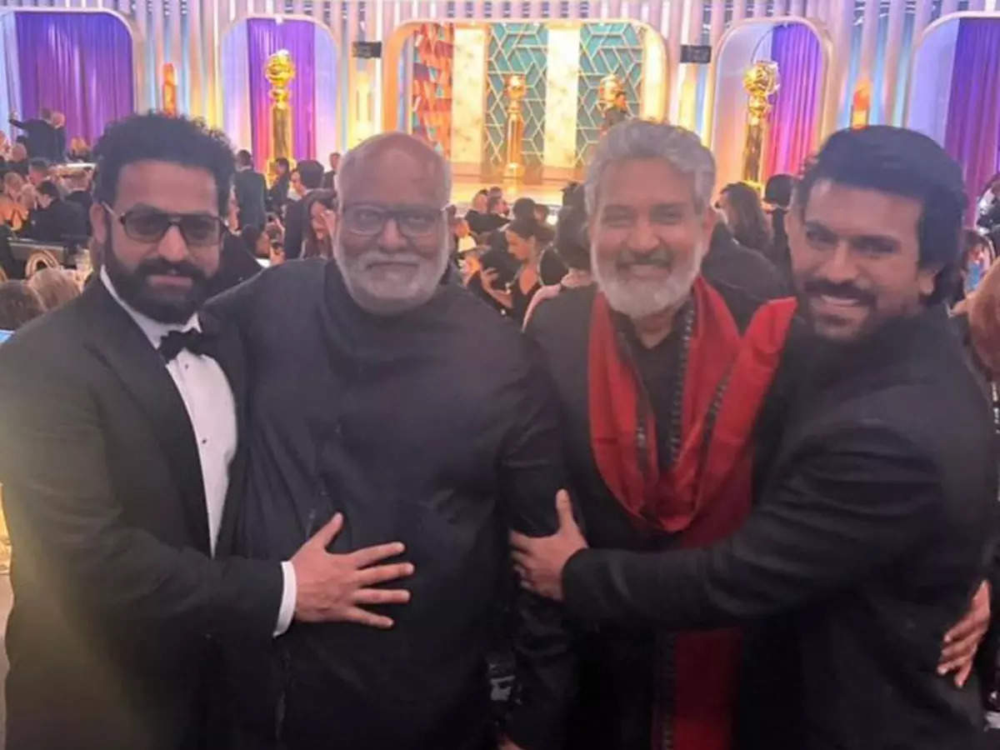
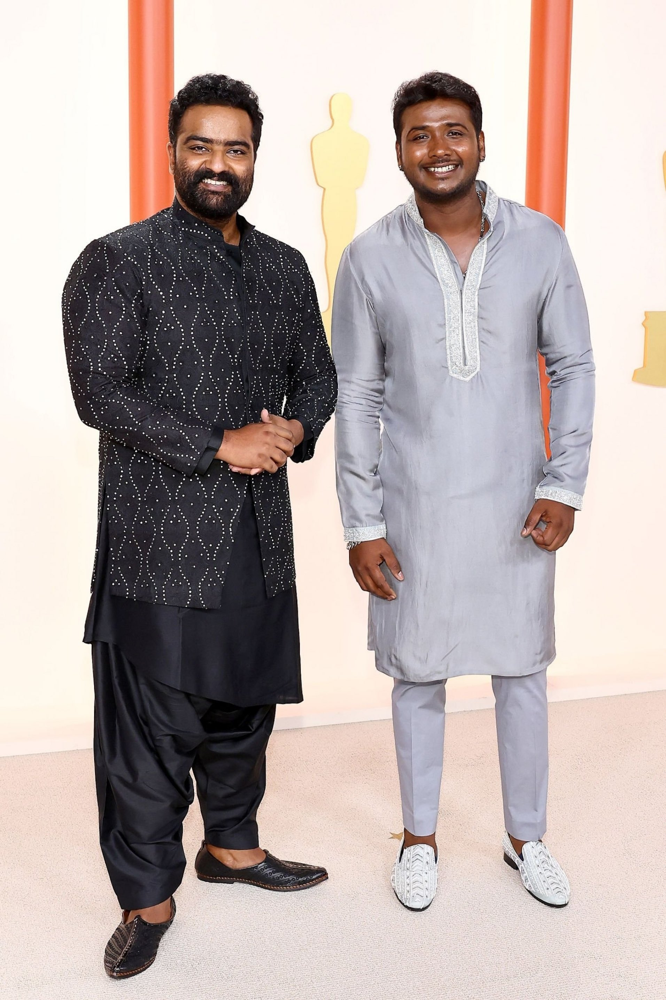
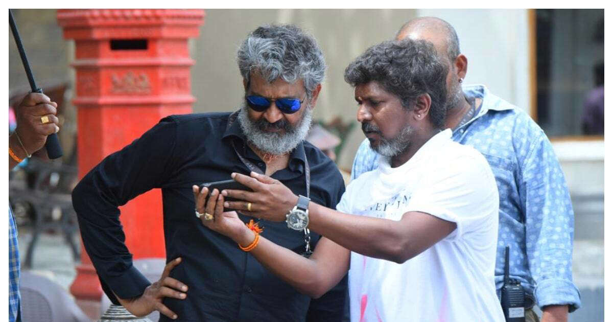

## Indian Cinema at the Oscars

In its 110-year-long cinematic journey, it is disheartening to know that a mere 4 ‘Indian’ productions have secured Oscar nominations and NEVER won the coveted award even once, despite being the second largest film industry in the world in the 1950s.

There have been glimmers of recognition in the past but Indian Cinema was majorly ‘unnoticed’ by the outside world until recently. And the worldview of Indian Cinema is changing.

So, after a good 21 years of Amir Khan’s Lagaan, when the team RRR showed up at the Oscars I couldn’t stop cheering and screaming! It was more than what I could take in.

After winning the Golden Globes and Critics Choice Awards beating the likes of Lady Gaga, Rihanna, & Taylor Swift for #NaatuNaatu in the Best Original Song Category, it was highly likely that RRR would win at The Academy as well!

And when the result was announced, I transcended into a different world of bliss.
–
There have been a few Indian representatives at the Oscars in the past but they were majorly under ‘international’ productions. And a handful of Indians even won the award: **Bhanu Athaiya, Satyajit Ray, AR Rahman, and Resul Pookutty**.

‘**Indian**’ films saw a total of 3 nominations for Best International Feature Film and 1 nomination for Best Documentary Feature so far in the past.

Though there have been Indian representations at the Oscars in the past - #RRR winning at the Oscars is such a game changer for the entire Indian movie industry. Here’s why:

## RRR - a Game Changer

### First Indian Movie

RRR is the first ‘Indian movie’ produced by an Indian production house, DVV Entertainment, to win an Oscar in any feature films category, it's unprecedented! (RRR missed another chance for Best International Feature Film - blame IFC if you want!)

### Huge market potential

This could open up a HUGE movie market around the world. A lot of new avenues have already been broke open, thanks to SS Rajamouli, but there’s still a long way to go…

The total movie market (theatre biz) is more than $42bn (as in 2019, when the business saw the highest numbers). India currently stands in 5th position:\
US: $10.5bn\
China: $9.3bn\
Japan: $2.4bn\
France: $1.62bn\
India: $1.6bn\
South Korea: ~1.6bn

There are other major markets beyond these regions, including UK, UAE etc which account to about $7.1bn where Indian movies are actively screened.

Check the box office numbers of all the countries [HERE](https://flixpatrol.com/market/box-office-revenues/).

So, RRR could now be a golden pass for other upcoming Indian movies to capture a piece of this huge market globally where Indian movies are actively screened - opening up a potential $32bn movie market.

### Increased budgets for upcoming Indian movies
This could also mean an increase in both the size of budgets and the number of big-budget movies coming from India.

The average budget of the top 10 most expensive Hollywood movies is a staggering $388mn! In comparison, the top 10 Indian movies average at a dismal $45mn - offering a significant gap for increasing investments and making bigger movies. So, the large production houses are bound to get influenced by this Oscars' result.

### Access to global talent
If the movie budgets and box office numbers don’t excite you if you are more of an ‘art’ person than a ‘commerce’ person, then - this RRR win could open doors to access global artists and global talent, from actors to actresses to technicians for the Indian filmmakers, that could lead to more and more high-quality films coming from India!

So, you can only imagine bigger, better, and grander movies coming from India in the future!

## The phenomenon called SS Rajamouli

A torchbearer, and a pioneer in many ways, SS Rajamouli now leads the path to greater glory for Indian cinema at the world cinema, and has permanently changed the trajectory of Indian cinema!

With Bahubali 1 & 2, he brought the entire film fraternity together - across different languages, transcending boundaries. Now, with RRR he has truly taken Indian Cinema global. From drawing people of the country together to taking the Indian Cinema global, SS Rajamouli is in a league of his own!

His RRR has grossed INR 1200 Cr already and has garnered so much attention, love and thumping responses from audiences around the world.

The audience filled the theatres completely whenever the movie was screened in the US and there was a re-release after a re-release multiple times. In fact, it set up a record of getting sold out in a mere 98 seconds when the tickets opened for booking in a 932 seater TCL’s Chinese Theatre in LA. The world was astounded by this craze!

And the movie is the highest-grossing Indian movie in Japan!

## Awards for RRR

It has received multiple awards including from Hollywood Critics Association, LA Film Critics Association Awards, New York Film Critics Circle Awards, Dada Saheb Phalke Film Festival, Hawaii Film Critics Society, Kansas City Film Critics Awards, and many others.

Check all the awards [HERE](https://www.imdb.com/title/tt8178634/awards/).

👏🏼👏🏼👏🏼 Congratulations to SS Rajamouli, NTR Jr, Ram Charan, MM Keeravani, Prem Rakshit, Chandrabose, Rahul Sipligunj, Kaala Bhairava and the entire team of RRR for truly ‘bringing back the glory of Indian Cinema!’🕺🏻💃🏻🕺🏻💃🏻🕺🏻💃🏻🕺🏻💃🏻

Also, congratulations also to the team of Kartiki Gonsalves’ The Elephant Whisperers for winning an Oscar for Best Documentary Short! 👏🏼👏🏼👏🏼

But the win by RRR is taking away all the media light!

Thanks for reading!

Check out my other articles too...