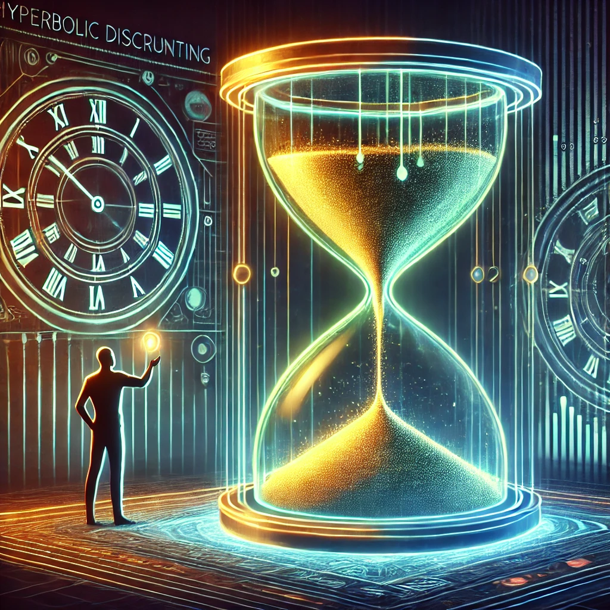

👋🏼 Hey there! Thank you for stopping by. 

😀 Please note that this is the eighth in a series of articles I am writing on Cognitive Biases. If you haven’t read the other seven yet, I’d recommend you read them first. **Links below:**

1. [Confirmation Bias](/p/confirmation-bias) ✅
2. [Fundamental Attribution Error](/p/fundamental-attribution-error) ✅
3. [Ikea effect](/p/ikea-effect) ✅
4. [Availability Heuristic](/p/availability-heuristic) ✅
5. [Framing effect](/p/framing-effect) ✅
6. [Forer effect](/p/forer-effect) ✅
7. [Belief Bias](https://arjunuvacha.com/p/cognitive-bias-belief-bias/) ✅
---

Let’s start with a quick scenario. It’s January 1st, and you’re feeling invincible. You’ve just signed up for a year-long gym membership, convinced that *this* is the year you’ll finally get in shape. The first week is fantastic—you hit the gym every day, share your progress with friends, and feel unstoppable. Fast forward to February. Work gets busier, motivation dips, and soon enough, your gym bag gathers dust. By March, you’re left regretting the expensive membership, wondering what went wrong. 🤔

Sounds familiar? 

This isn’t just about fitness. It’s about the way we tend to **overestimate short-term wins** while underestimating the patience, consistency, and discipline required for long-term success. 

Take another example—a credit card with an irresistible 0% interest offer. You think, *“This is easy! I’ll pay it off before the period ends.”* But months later, life happens, you miss the deadline, and suddenly, you’re hit with high-interest debt you didn’t see coming. 

So, why do we keep falling into this trap?

The answer lies in **hyperbolic discounting**, a cognitive bias that tricks our brains into valuing immediate rewards far more than future benefits. Let’s dig into why this happens and how to escape the cycle. 

---

## **Hyperbolic Discounting: The Brain’s Short-Term Bias**

Hyperbolic discounting is our tendency to prefer smaller, immediate rewards over larger, delayed ones. It’s why we procrastinate, struggle with long-term goals, and make impulsive decisions. Our brain naturally prioritizes NOW over LATER, even when later is objectively better. 

### **Why Do We Fall for It?**
Here are the top 5 reasons why I think this happens.

### 🧠 **1. Evolutionary Instincts**
Back in the day, our ancestors had to prioritize immediate survival. If they found food, they ate it immediately—because who knew when the next meal would come? Planning for the distant future wasn’t valuable in an unpredictable world. Fast forward to today, and our brains still hold on to this wiring, making it hard to resist instant gratification. 

### 🔮 **2. Uncertainty of the Future**
One of the biggest reasons people overestimate short-term wins is the uncertainty of the future.
When faced with a choice between immediate rewards and long-term benefits, we instinctively favor the present because the future feels unpredictable and beyond our control.

For example, consider a tech startup with limited funding. The founders have two choices:
1. Invest in long-term product development—building a robust platform, focusing on retention, and gradually acquiring loyal users.
2. Push for rapid user growth through heavy discounts, aggressive marketing, and short-term promotions, hoping that high numbers will attract investors.

Most likely, many startups choose the second option because future success is uncertain. They think, “Who knows if we’ll survive long enough to see long-term results? Let’s show impressive numbers now.” However, once the discounts stop, most of these users churn, leaving the startup with unsustainable growth and financial strain.

This decision-making pattern isn’t just seen in businesses. Individuals do it all the time. Many people avoid investing for retirement because the benefits feel distant and uncertain. Instead, they spend impulsively on things that bring immediate pleasure, assuming they will “figure it out” later.

### 😍 **3. Emotional Impulsivity**
Immediate rewards trigger dopamine, the brain’s pleasure chemical. That’s why eating a donut feels better than saying no in favor of long-term health. Delayed gratification takes discipline, and let’s be honest—it’s hard! 

### 🎯 **4. Short-Term Motivation Loops**
Short-term wins give us quick validation. Posting about a gym session on Instagram brings instant likes, while real results—like losing weight or building muscle—take months. This immediate feedback keeps us hooked.

### 🤯 **5. Cognitive Overload**
When life gets overwhelming, our brain defaults to the easiest, most rewarding option. Long-term goals require sustained effort, patience, and strategic planning—things that feel mentally exhausting when juggling daily stressors. The harder a decision appears, the more tempting it becomes to choose short-term relief, even if it leads to long-term setbacks. This is why consistency often feels so difficult.

---

## **Undersood why we fall for it. But what do we gain?**

### ⚡ **1. Instant Gratification Bias**
We crave rewards *now* rather than waiting for bigger payoffs later. Whether it’s junk food over meal prep, or binge-watching instead of studying, our brains prioritize immediate pleasure over patience. 

### 📊 **2. Short-Term Metrics Drive Motivation**
Immediate feedback feels more rewarding than waiting for long-term progress. That’s why businesses focus on quarterly earnings rather than sustainable growth, and why students cram instead of adopting better study habits. 

### 👥 **3. Social Proof & Peer Influence**
Seeing others celebrate quick wins influences our perception of success. When startups flaunt rapid user growth but ignore retention, or influencers share overnight success stories, we assume short-term wins are more valuable than they actually are. 

### 🌀 **4. The “Present Bias” Illusion**
We assume our future self will be more disciplined, focused, and capable of handling challenges. “I’ll start saving next year” or “Future me will be more responsible” are classic examples of how we trick ourselves into postponing key decisions. 

### 🚧 **5. Underestimating Long-Term Effort**
We often miscalculate how much time, effort, and consistency are required for real success. Many expect to see drastic results after just a few weeks of dieting, but true health transformations take months or years.

---

## **When does this become a problem?**

Short-term wins aren’t inherently bad, but when they take priority over long-term strategy, they can be **destructive**:

❌ **Poor Financial Decisions** – People often prioritize immediate spending on luxuries or impulsive purchases rather than long-term financial health. This leads to accumulating debt, missed investment opportunities, and financial stress in the future.

❌ **Unrealistic Business Strategies** – Companies chasing quick profits frequently compromise sustainable growth by neglecting innovation, customer retention, or long-term value creation, ultimately leading to instability.

❌ **Burnout & Frustration** – Expecting instant success in careers or personal goals often results in disappointment. When results take longer than expected, frustration sets in, leading many to give up too soon.

❌ **Shallow Skill Development** – Constantly jumping between different pursuits for quick wins prevents deep expertise. Mastery requires sustained effort, but chasing rapid results results in limited proficiency and weaker long-term outcomes.  

---

## **Got it. How can I work on it?**

Breaking free from the cycle of hyperbolic discounting takes effort, but it’s absolutely possible! Let's see how.

### 🌍 **1. Adopt a Long-Term Mindset (The "10-Year Rule")**
Before making a decision, ask yourself: *Will this choice still benefit me in 10 years?* If the answer is no, reconsider. This rule helps filter out impulsive decisions and encourages choices that align with long-term success. Many decisions that seem urgent today will feel irrelevant a decade from now. Prioritizing future stability over momentary pleasure prevents regret and fosters consistent growth.

### 🔄 **2. Create Systems Instead of Just Goals**
Rather than focusing on *one-time goals* like "lose 10kg," shift your focus to **building habits**—such as consistently exercising, eating well, and tracking progress. Goals are great for setting direction, but systems ensure long-term sustainability. A well-designed system keeps you moving forward even when motivation fades, making success more predictable and manageable over time.

### ⏳ **3. Use the “24-Hour Rule” for Big Decisions**
If you’re about to make a major decision—whether it’s making a large purchase, quitting a job, or responding to an emotional situation—wait 24 hours before acting. This cooling-off period allows you to assess whether your decision is driven by impulse or logic. Often, after a day, what felt urgent no longer seems as appealing, helping you avoid costly mistakes.

### 📈 **4. Validate Short-Term Gains With Long-Term Data**
Short-term success can be misleading if it’s not backed by real, long-term impact. In business, product development, and personal growth, rely on **data-driven insights** rather than momentary spikes. Track trends over time to differentiate sustainable growth from temporary surges. By making decisions based on consistent patterns rather than short-term excitement, you avoid chasing misleading wins that don’t contribute to lasting success.

### 🏆 **5. Celebrate Long-Term Wins**
Instead of only acknowledging short-term achievements, shift your focus to recognizing **sustainable progress**. Whether in personal goals, career growth, or business milestones, long-term success often goes unnoticed because it lacks immediate excitement. However, celebrating consistent effort and meaningful progress fosters resilience and encourages sustained commitment. Leaders should create an environment where perseverance and strategic growth are valued over quick wins.

---

## **Conclusion: Think long!**

Short-term wins feel great, but they rarely lead to meaningful success on their own. Understanding **why** we overestimate them and **how** hyperbolic discounting tricks our brain can help us make better choices. 

Whether it’s fitness, finances, career goals, or business decisions, learning to **balance short-term motivation with long-term vision** is the key to sustained success. 

Next time you’re about to make a decision, pause and ask: *Am I choosing short-term excitement over long-term value?*

Making that small shift in thinking can unlock greater success, stability, and fulfillment in the long run. 

💬 **What’s one short-term decision you regret? Share your thoughts below!** 😊

---
**Thank you for reading! 🙏🏼**

👍🏼 ➡️ If you liked it, please share it with others who might find it interesting!