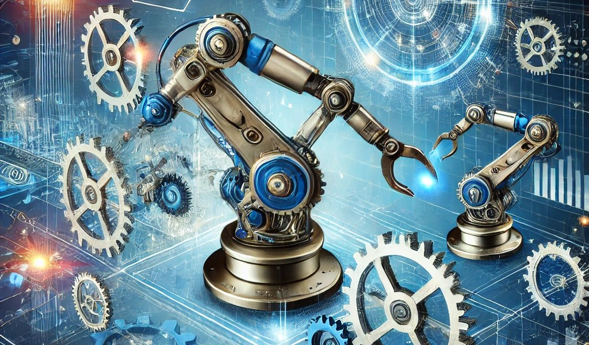
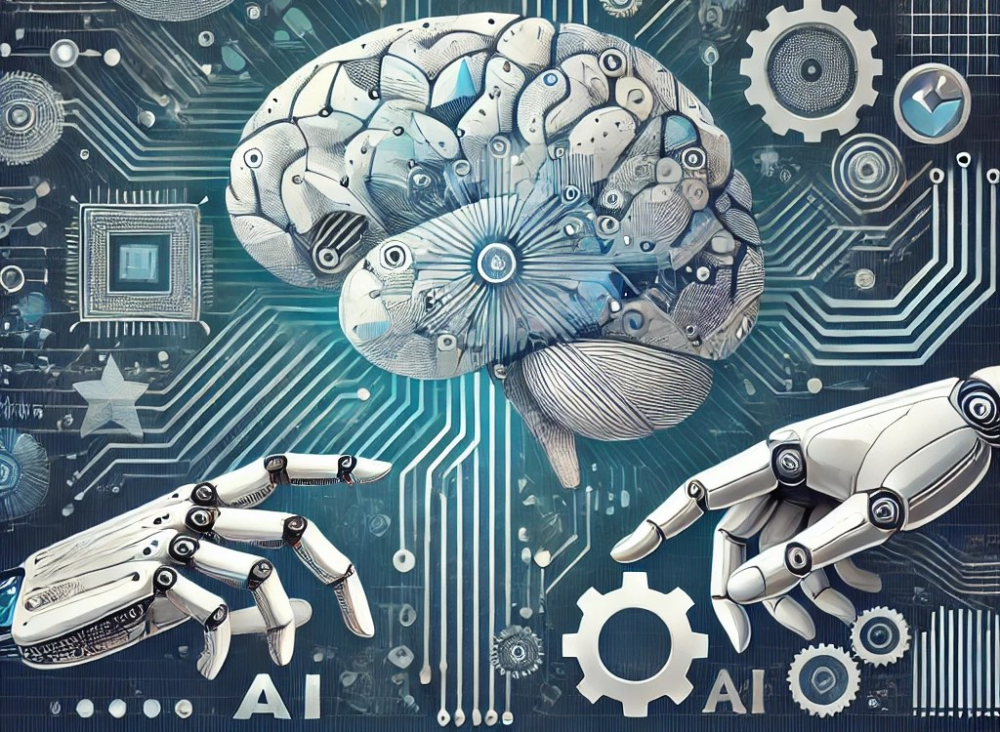

👋🏼 Hello! Thank you for stopping by.

😀 If you’re a product manager or an AI enthusiast, this article is for you. In this article, I have explored how AI is transforming the world of product management and how we, as leaders, can embrace this change to create a lasting impact.

Before we dive in, take a moment to reflect: Have you ever made a decision that felt more instinctual than data-driven? Or spent hours poring over routine tasks that seemed to pull you away from strategy and innovation? If so, you’re not alone. And here’s the good news — AI is here to help. 

Let’s walk through how AI is reshaping three critical aspects of product management: decision-making, automating routine tasks, and creating deeply personalized customer experiences. Along the way, I’ll share a few stories and lessons to make it relatable. I hope they resonate with you as much as they do with me.

---

## 🚀 The Shift in Decision-Making with AI

When I think of decision-making, I’m reminded of my early days as a product manager. Back then, decisions often relied on gut feeling, past experiences, and scattered data. But today, AI is changing the game.

### 🧠 Data-Driven Decision Superpowers
AI allows product managers to process massive amounts of data, uncovering patterns and insights that were once unimaginable. Imagine having a tool that not only identifies trends but also predicts what’s coming next. That’s what AI brings to the table.

Take, for instance, an Indian e-commerce platform targeting diverse customers across regions. With AI-powered analytics, the platform can identify that sarees are trending in Tamil Nadu while contemporary fashion is booming in Mumbai. Armed with these insights, PMs can align inventory and marketing strategies to meet regional demands.

Reflecting on this, I’m reminded of Marty Cagan’s words: “The best product managers don’t just react to data; they use it to anticipate what’s next.” With AI, we can do just that.

### 🕒 Real-Time Insights for Agile Management
AI tools provide real-time dashboards and predictive analytics, enabling us to monitor metrics and pivot quickly when needed. Picture a fintech PM in India receiving an AI-generated alert about a sudden drop in user engagement. Instead of waiting for a quarterly review, the PM can investigate immediately, ensuring swift action to address the issue.

These real-time insights remind us that being proactive is key to staying ahead in a fast-paced market.

---

## 🤖 Automating Routine Tasks to Elevate Strategy

Let’s face it, we’ve all been there — stuck in the endless loop of managing backlogs, compiling user feedback, and updating roadmaps. While these tasks are important, they often leave little room for strategic thinking. That’s where AI steps in to save the day.

### 🔍 Streamlining Market Research
Market research, which used to take weeks, can now be done in minutes. AI tools equipped with Natural Language Processing (NLP) analyze reviews, social media chatter, and survey responses to extract actionable insights.

This reminds me of a conversation with a PM friend working in consumer tech. He shared how an AI tool helped him uncover user pain points by analyzing thousands of online reviews. What would have taken weeks was done in a single afternoon — leaving him free to focus on designing solutions.

### 💬 Simplifying Feedback Collection
Feedback collection is another area where AI shines. Imagine deploying a chatbot on your app to gather user feedback 24/7. The bot not only collects responses but also analyzes sentiment, categorizing feedback into themes. This eliminates the need for manual sorting and ensures no valuable insight is missed.

### 📅 Enhancing Roadmap Management
With AI-enabled project management platforms, updating roadmaps and identifying dependencies becomes a breeze. I recall how a colleague once marveled at how his AI tool suggested optimal timelines for a multi-team project. The time saved allowed him to focus on building a compelling product vision.

---

## 🌟 The Power of Personalization Through AI

If there’s one thing we all crave as customers, it’s personalization. AI takes this to a whole new level, enabling PMs to create deeply tailored experiences that resonate with users.

### 🎯 Advanced Customer Segmentation
AI dives deep into user data, segmenting customers into highly specific cohorts. Unlike manual segmentation that relies on assumptions or broad categories, AI builds clusters based on behavior, preferences, geography, and more. Picture an OTT platform analyzing viewing patterns across India. It notices that a family in Delhi prefers Bollywood classics and kids’ cartoons, while a tech-savvy college student in Bangalore binges trending regional dramas. With these insights, the platform doesn’t just push generic recommendations — it curates a viewing experience tailored for each user, boosting satisfaction and engagement.

But segmentation doesn’t stop at content. AI also helps businesses refine marketing strategies. For example, targeted promotions for seasonal products or region-specific offers can lead to higher conversion rates. This ability to micro-target ensures no opportunity is left untapped.

### 🔮 Anticipating Customer Needs
AI doesn’t just respond to customer behavior — it predicts it. Think of a ride-hailing app that uses AI to forecast demand spikes during festivals or rainy seasons. By analyzing historical data and real-time inputs like weather conditions, the app adjusts its driver allocation and pricing proactively. Customers experience shorter wait times, and drivers benefit from increased demand, creating a win-win scenario.

Or imagine an online grocery store predicting when a customer might run out of essentials like milk or bread, based on their purchasing habits. The store can then send timely reminders or offer subscriptions, ensuring the customer never runs out. These proactive measures not only delight users but also build trust and loyalty over time.

---

## 🔑 Key Skills for Product Managers in the AI Era

As AI continues to transform the role of product management, it’s clear that product managers need to evolve alongside it. While AI automates and simplifies many tasks, it also introduces new challenges and opportunities. Embracing this change requires a shift in mindset and a willingness to learn. Let’s discuss the skills that PMs need to stay ahead in this AI-powered world.

The role of a PM is no longer limited to traditional responsibilities like roadmap planning or stakeholder management. Today, PMs must act as the bridge between cutting-edge AI capabilities and real-world user needs. They must learn how to work with AI, use it effectively, and ensure it aligns with the overall product vision. Here are a few skills that I believe are crucial:

### 📊 Embrace Data Literacy
Data literacy is the foundation of thriving in an AI-driven environment. PMs don’t need to be data scientists, but they must be comfortable interpreting AI outputs and working with data teams. Understanding data structures, metrics, and AI algorithms allows PMs to ask the right questions and make informed decisions.

### ❤️ Cultivate Empathy
While AI excels at analyzing data, it’s up to PMs to ensure decisions remain human-centric. Empathy helps PMs understand the deeper motivations and emotions of users, bridging the gap between data-driven insights and real-world impact. After all, no algorithm can fully replace the intuition and emotional intelligence of a human PM.

### 🎯 Focus on Strategy
AI frees up time, but that time must be spent wisely. Strategic thinking becomes even more critical when AI takes care of routine tasks. PMs must define bold product visions, prioritize high-impact initiatives, and ensure that AI capabilities are aligned with long-term goals.

### 🤝 Collaborate with AI
Think of AI as the ultimate product intern: reliable, efficient, and capable of handling tedious tasks. But just like any intern, AI needs guidance and oversight. PMs should experiment with AI tools, integrate them into workflows, and treat them as collaborative partners rather than replacements.

### 🔄 Adaptability and Curiosity
The AI landscape evolves rapidly, and PMs must stay curious to keep up. Continuous learning—whether through workshops, online courses, or collaboration with AI teams—ensures that PMs remain equipped to navigate this dynamic environment.

---

## 💡 Conclusion: A New Era for Product Management

AI is no longer a futuristic concept; it’s a present reality. By enhancing decision-making, automating tasks, and enabling personalization, it empowers product managers to create extraordinary outcomes.

For Indian businesses, the potential of AI is immense. With our diverse markets and evolving customer expectations, embracing AI isn’t just an advantage — it’s a necessity. As Marty Cagan says, “The best PMs harness AI not to replace their role, but to elevate it.”

So, here’s my question to you: How will you leverage AI to transform your product and create a lasting impact? I’d love to hear your thoughts! 😊

Thank you for reading! 🙏🏼

👍🏼 ➡️ If you liked it, please share it with others who might find it interesting!

💬 Also, please share your comment or feedback.