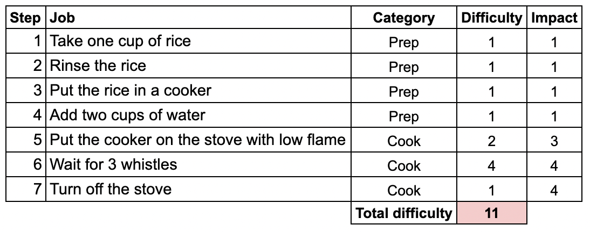
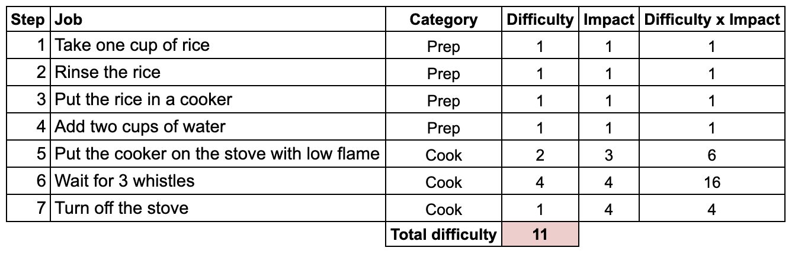
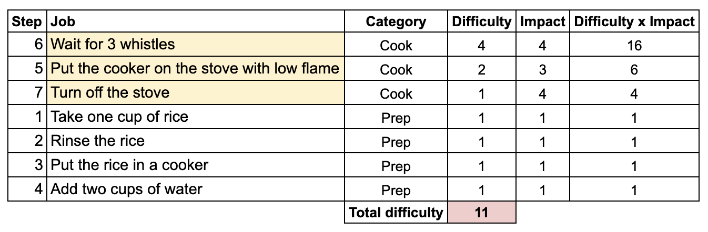
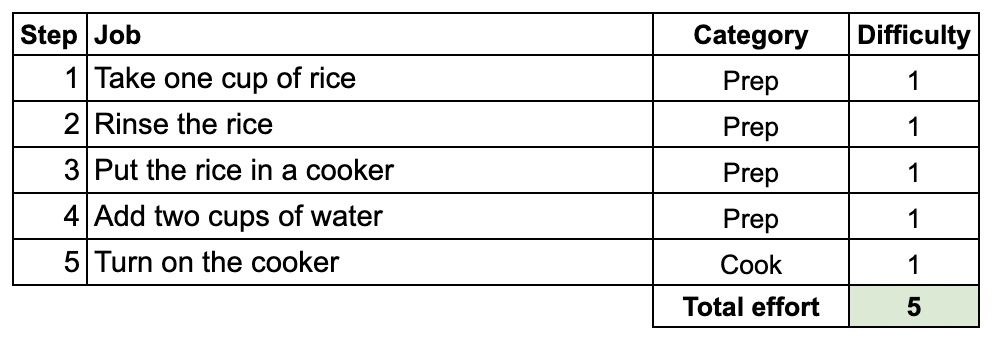

## Introduction
As Product Managers, our primary responsibility is to solve user problems and make the user’s life easy. More often than not, we are tasked to deal with one or the other complex problem with a lot of nuances, made up of smaller interconnected problems making it a complex web to address.

For example, look at the following problem statement: **Increase the monthly revenue from a product category by 10%.**

It is a vague problem to work on. But you can get started by asking some questions to understand the problem better, like:
1. Is there enough demand for the product?
2. Which channel offers the best scope to improve revenues?
3. Is the communication and messaging by the marketing team bang on?
4. Are there any delivery constraints?
5. And so on…

These are very important questions to answer and we often get swamped with so much data that it gets difficult to identify which ones to pick and work on. How do we deal with such situations?

One of the ways of doing this is by identifying or breaking the complex problem into multiple smaller sets of tasks or jobs to be done by different stakeholders along the user journey.

### Example
For example, if you look at the user journey of placing an order from the above-discussed product category problem statement, these could be some of the jobs to be done:
1. Identify the right target user
2. Market (or show an Ad) to the user
3. Get the user to click on the marketing campaign
4. Make the user register
5. Show the user what the user wants
6. Make the experience smooth for the user to add products to the cart
7. Build a smooth payment/check-out journey
8. Deliver the product to the user

### What does this do?

This helps break down complex problems into a series of jobs to be executed (by people) at a granular level. Because each job is at a granular level, it gets easy to identify how difficult is it for the user to do the job. The more the difficulty implies more the problem. And the more the problem more the opportunity to solve. Similarly, if each job is complicated or takes more time or effort by the user, it offers more opportunities to solve.

### Ok. But, how does this help?

Once all the complex problems are broken down into a series of smaller jobs to be done by various stakeholders involved, you will end up with a simple list of jobs. And you can then choose which jobs are ‘worth solving’ based on how difficult they are and what impact they create for the user.

It helps in breaking the complex problem into granular bits giving better visibility and the ability to prioritise them.

**Unable to follow?**

## A case study from personal life

Let me explain this by taking a very simple day-to-day scenario.

### Scenario
**The scenario:** Abhinav is a working professional and he finds it difficult to cook rice.

If I was asked to simplify the cooking experience and make the *‘complex problem’* of cooking rice easy, how would I do it? Would I build a washing machine or an electric cooker? How do I decide what needs to be built?

### Breaking down the problem
Now, if I break down this problem for the user (Abhinav), there would be 7 jobs involved as listed below:
1. Take one cup of rice
2. Rinse the rice
3. Put the rice in a pressure cooker
4. Add two cups of water
5. Put the pressure cooker on the stoke with low flame
6. Wait for 3 whistles
7. Turn off the stove

#### The outcome: Cooked rice!

An easy way to make the cooking experience better for Abhinav is by identifying which of those jobs are the most difficult and simplifying them. Right?

Let’s do that.

### The job, difficulty, impact matrix
To do this, let me first create a matrix with four columns:
1. The job to be done
2. The category of the job
3. Difficulty in doing the job
4. The impact created for Abhinav if the job is simplified

The category column could simply be some way of bucketing/categorising the jobs.

The difficulty and impact could be assigned on a scale of 1 to 5, with 1 being least difficult/impactful and 5 being most difficult/impactful.

By doing this, instead of looking at a complex problem, I will now be able to look at a list of categorised tasks, the effort required to perform them and their impact on Abhinav.

I have broken these jobs into two categories: Prep and Cook, and assigned their level of difficulty and impact.

The matrix would look something like this:

* You can notice that steps 1 to 4 are simple and do not take much effort from Abhinav, hence the difficulty assigned for them is 1. And because Abhinav does not perceive much impact if these steps are solved, the assigned impact also is 1 for them.

* The next two steps require Abhinav to handle the pressure cooker correctly, turn on the stove, put it on low flame and wait for 3 whistles - these are burdensome. It calls for the user’s effort, availability and attention. Hence they are assigned higher difficulty points. Solving these steps will make it that much less burdensome for the user, so the impact created for Abhinav also will be much higher if these steps are simplified.

* The final step, Step 7, is also of low effort, with a difficulty of 1 point. But it is the closing and an important step. Abhinav has to turn off the stove without fail, if not the rice will be burnt. Though it does not take much effort, it is a must. Now, if this step is solved, then the perceived impact for Abhinav is very high as he does not have to worry about turning off the stove. That’s a great relief and would also allow him to focus on other activities. Hence this job is assigned an impact of 4 points if simplified.

**The total difficulty of the user to cook the rice is 11 points.**

### Adding the Difficulty x Impact column
How do I make this entire process less difficult?

Let’s add one column to this matrix: Difficulty x Impact = product of difficulty points and impact points. The matrix would look like this:

Now, if I had to choose which jobs to work on, to give a better cooking experience, I would  choose the ones with **High Difficulty and High Impact.**

This can be achieved by looking at the **‘Difficulty x Impact’ column**, I would get the prioritised jobs as:

### Prioritising the problems
**So, I would like to ensure that:**
1. The user doesn’t have to wait
2. The user doesn’t worry about putting the cooker on the stove with the right flame
3. The user doesn’t have to worry about turning off the stove

Based on this, I could ask Abhinav to use an electric cooker instead of a pressure cooker, which solves the top three challenges for him. And below will the steps he would need to follow:
1. Take one cup of rice
2. Rinse the rice
3. Put the rice in a pressure cooker
4. Add two cups of water
5. Put the rice in an electric cooker (the cooker will turn off automatically)

#### The outcome: Rice is cooked!

If we look at the matrix again, replacing the pressure cooker with an electric cooker, it would look something like this:

## Final observations
With this solution (of using an electric cooker), **the effort has been reduced from 11 points to 5 points,** with the same outcome in both cases: cooked rice!

If you notice, I worked on the ‘Cook’ category of the problems, without worrying much about the ‘Prep’ category.

Instead, imagine if I had prioritised the ‘Prep’ category and focused on solving steps 2 or 3 or 4: rinsing of rice or automatic measurement of water quantity then I would have proposed using **a washing machine for cooking rice** (which sounds like a ridiculous idea!) because a washing machine does the best job in solving the rinsing and the measurement problem. However, those steps are not what the user sees as daunting or difficult. So, if I had chosen to solve steps 2, 3, or 4, I would have put all my efforts into solving the **wrong** problems for the user. And had this solution been proposed and implemented, it would have probably made life even more difficult for Abhinav, isn't it?

## Conclusion
Long story short, what I want to convey is, if you break down the complex problem (or process) into minor tasks or jobs, assign them their difficulty and impact, and prioritise based on their difficulty and impact levels, it becomes much clearer (and easier) to pick which parts of the seemingly complex problem to work on.

**So, are you working on building a washing machine or an electric cooker?**\
Well, think again!

Thank you for reading. If you found this interesting, please share this with other Product aspirants!